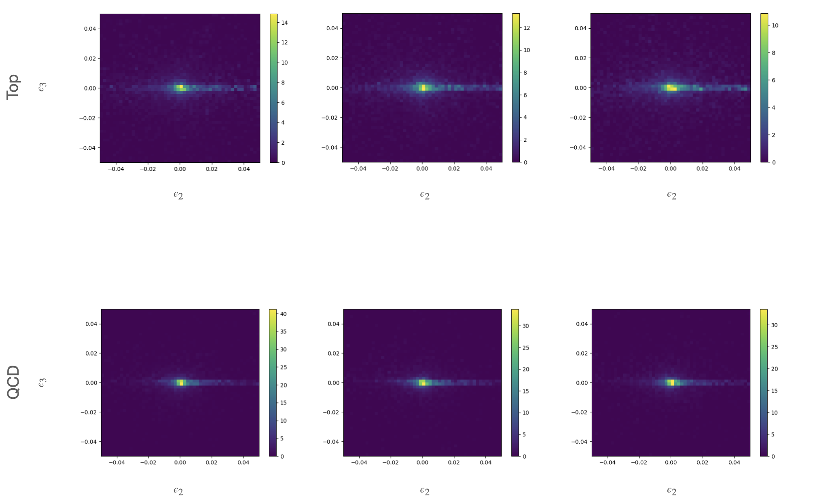

# QCNNs4JetImagesClassification

Motivated by the problem of complex top-quark jet images produced as a result of hypothesized beyond-Standard-Model (BSM) particles, this project aims to utilize a Quantum Convolutional Neural Network (QCNN) model to improve classification accuracy between top-quark jet signals and the corresponding QCD background. QCNN architecture was introduced by Cong et al. (2020) and has been utilized in various classification tasks showing promising results.  


---

## Getting Started

### Prerequisites
- Python 3.8+
- Jupyter Notebook
- Recommended libraries: 
  - numpy
  - JetNet
  - matplotlib
  - scikit-learn
  - torch / tensorflow
  - pennylane 

### Installation

Clone the repository:
```bash
git clone https://github.com/haelhag/QCNNs4JetImagesClassification.git
cd QCNNs4JetImagesClassification
```

## Usage

### Prepare the dataset
Open and run the notebook:
```bash
jupyter notebook CreateTopQCDJetImages_JetNet.ipynb
```

**jet images example:**  


### Train and evaluate the QCNN model

Run:
```
jupyter notebook QCNNs_for_jet_images_classification.ipynb
```

### Inspect results

Metrics and plots are generated in the notebook during execution.

## Results

- The QCNN demonstrates the potential to classify top-quark jet signals from QCD backgrounds.  
- Evaluation metrics (accuracy, loss, ROC curves) are shown in the main notebook.  
- Results suggest QCNNs may offer advantages over classical CNNs in this domain.


## License

This project is licensed under the MIT License. See the [LICENSE](LICENSE) file for details.

## Acknowledgements

- Cong et al. (2020), *Quantum Convolutional Neural Networks*  
- [ML4SCI Hands-On QCNN for MNIST](https://github.com/ML4SCI/QML-hands-on/blob/main/notebooks/4_QCNN_MNIST.ipynb) for the initial coding framework  
- Inspiration from quantum machine learning research applied to high-energy physics  

## References

- Elhag, H., et al. (2024). *QCNNs for Jet Images Classification*. [arXiv:2408.08701](https://arxiv.org/abs/2408.08701)  


